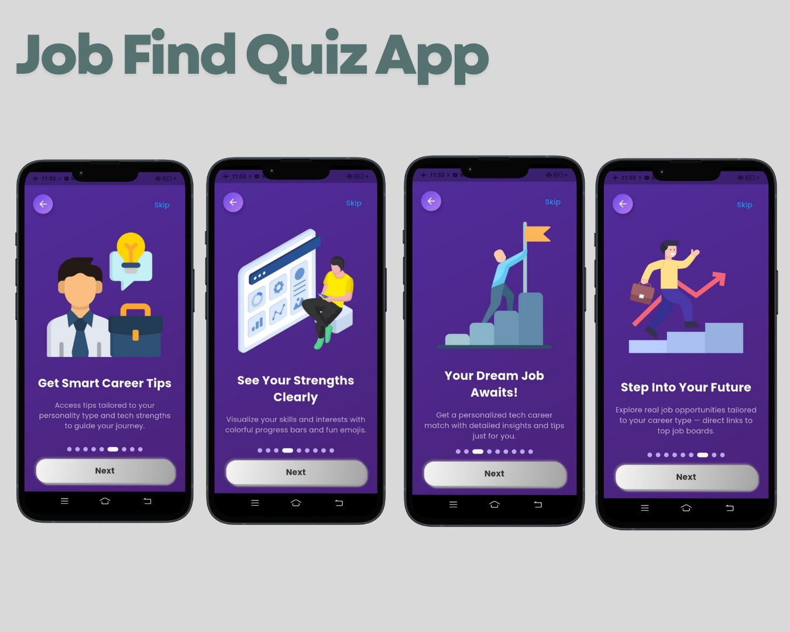

# 🎯 Job Finder Quiz App

A sleek, user-friendly Flutter app that helps users discover their ideal tech career through an engaging quiz experience. Built with modern design, smooth animations, and interactive UI — this app combines fun with functionality to guide users toward their future in tech.

---

## 🚀 Features at a Glance

🔍 **What to Expect?**  
10 quick questions designed to uncover your tech strengths and passions — complete with emojis and easy choices.

🧭 **Explore Diverse Tech Roles**  
From AI Engineer to Cybersecurity Specialist, explore various career paths that match your unique profile.

🌟 **Your Dream Job Awaits**  
Get a personalized career suggestion with detailed insights and helpful tips tailored to your answers.

📊 **See Your Strengths Clearly**  
Visualize your quiz results with beautiful progress bars, emojis, and a modern layout.

🎯 **Discover Related Career Paths**  
Get instant suggestions of tech roles aligned with your skills — tap to learn more in a smooth, interactive way.

💡 **Smart Career Tips**  
Receive tailored advice based on your personality type and strengths to help guide your tech journey.

🌐 **Explore Real Job Opportunities**  
Direct links to real-world job openings from top job boards — matched with your career type.

🧠 **Tap to Learn More**  
View salary info, required skills, and career details in a sleek popup after completing the quiz.

🎉 **Why It’s Fun?**  
Interactive design, fun animations, emojis, and a touch of tech magic — all crafted to keep users engaged.

---

## 📱 Built With

- **Flutter** — Cross-platform mobile framework
- **Dart** — Programming language powering the app
- **Custom UI Design** — With smooth transitions & clean layouts
- **Interactive Widgets** — For dynamic and responsive experience

---

## 📸 Screenshots




---

## 💡 Future Enhancements

- Firebase integration for storing results
- Dark mode support
- User login/profile
- Career tracking dashboard

---

## 🧠 About the Developer

Made with ❤️ by [Tanim Mahmud](https://github.com/TanimStu068) — a passionate Flutter developer exploring creative ways to combine career guidance and engaging tech experiences.

---

## 📂 How to Run Locally

```bash
git clone https://github.com/TanimStu068/job_fInder_quiz_app.git
cd job_fInder_quiz_app
flutter pub get
flutter run
